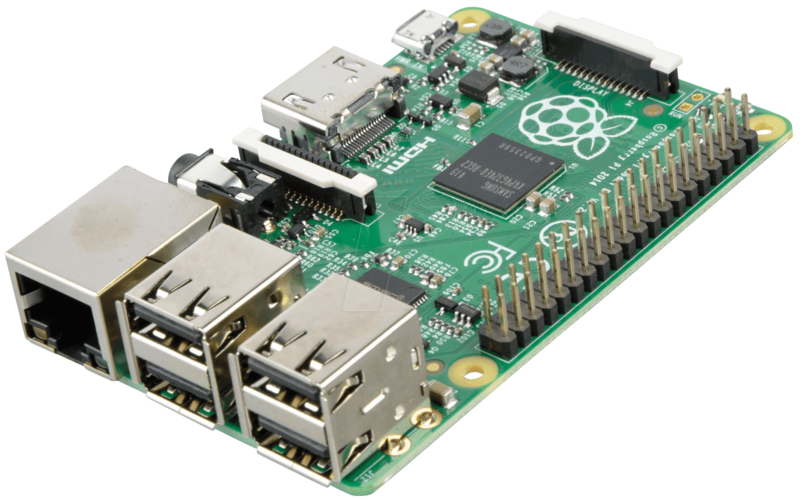

# GNU/Linux in tiny places
## small platforms for all types of shenanigans

Chris McCormick

<chris@mccormick.cx>

---

# History

### linux.conf.au 2005

> ...developing software for the Gameboy Advance using Linux and other open source tools...

### linux.conf.au 2007

> GNU/Linux on handheld gaming devices
> 
> (Nintendo DS, gp2x)

---

# Tiny places

 * Termux on Android
 * piCore on RPi

---

# Setup

 * Seven square
 * Webcam

---

# Termux on Android

---

# Termux on Android

 * Android application
 * GNUish userspace
 * on Android Linux kernel

---

# Termux on Android
## Hardware

 * $39 Android phone
 * Cheap prepaid plan

---

# Termux on Android
## Hardware

 * $39 Android phone
 * Cheap prepaid plan
 * Screen + camera
 * Speaker + Microphone
 * GSM data (internet)
 * SMS

---

# Termux on Android
## Software

 * F-Droid
 * ~~GOOG~~
 * Termux packages
 * No root

---

# Termux on Android
## Scripting

 * Terminal UI
 * Shortcuts UI
   * ~/.shortcuts
 * Boot scripts
   * ~/.termux/boot
 * Package manager:
   * `pkg install somepackage`

---

# Termux on Android
## Scripting

 * Capabilities?
  * termux-*

---

# Termux on Android
## Scripting

 * Capabilities?
  * termux-*
  * termux-sms-*

---

# Termux on Android
## Scripting

 * Capabilities?
  * termux-*
  * termux-sms-*
  * termux-camera-photo

---

# Termux on Android
## Scripting

 * Capabilities?
  * termux-*
  * termux-sms-*
  * termux-camera-photo
  * termux-tts-speak

---

# Termux on Android
## Server

 * SSH server
 * HTTP server
 * ~~Public IP~~
 * SSH tunnel

---

# piCore on RPi

---

# piCore on RPi
## Hardware

 * Raspberry Pi
 * Everything via GPIO

---

# piCore on RPi
## Software

 * piCore == TinyCore Linux
 * 49M image
 * Read only - immutable!
 * packages as mount points

---

# piCore on RPi
## Software

 * Persist changes:
   * filetool.sh -b
 * Boot scripts:
   * /opt/bootlocal.sh
 * Package manager:

`tce-load -wi somepackagename`

---

# piCore on RPi
## Hack

 * LED flash demo:
   * Nodejs
   * Python
 * Hats

---

# piCore on RPi
## LED-over-HTTP

http://10.27.8.217:8000/led.php

---

# piCore on RPi
## LED-over-SMS

# 0481 300 706

---

# piCore + Termux
## World's cheapest robotics platform?

---

# GNU/Linux in tiny places

Chris McCormick

<chris@mccormick.cx>

